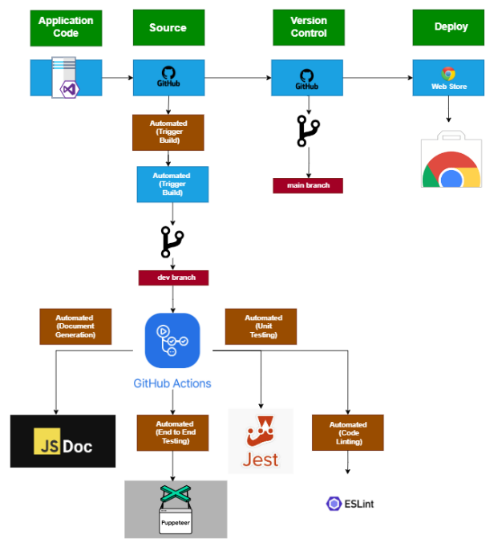

# CI CD Pipeline Progress and Decisions

###  Linting and code style enforcement (may happen in pipeline and/or in editor)
    
      - We have ESLint code checking that happens in github actions on every single pull request to our dev branch or main. 
        
    -  Alternative was CodeClimate, but code climate was significantly more bloated than ESLint for additional functionality that we didn’t need that badly. The final straw was the Ruby/Gemfile.
        
###  Code quality via tool (ex. Codeclimate, Codacy, etc.)

    -   Not yet implemented
        
###   Code quality via human review (ex. pull requests)
    
    -   We added a requirement for a single reviewer for each PR that gets merged to dev, and 3 reviewers to merge from dev to the main branch.
        
###   Unit tests and Integration Tests  via automation (ex. Jest, Tape, Ava, Cypress, Mocha/Chai, etc.)
    
    -   We used Jest for both integration and unit testing. Github actions file for jest calls all .test.js files in the repo, which includes basic unit tests as well as end-to-end/integration tests using puppeteer. 
        
    -   Not enough code in the repo for Jest tests, so made a fake “sum” function to confirm that our github actions  work properly.
        
    -   Integration tests run headless with our chrome extension loaded in, and retrieve our extension ID via a custom function call.
        
###   Documentation generation via automation (ex. JSDocs)
    
    -   Used JSDoc in order to implement documentation generation.
        
    -   Happens on every merge to the dev branch. Runs JSDoc on the whole repo, and then deploys a site via github pages that hosts the documentation of the most recent commit to our dev branch
        
    -   JSDoc site also includes whatever content we populate via our README.md file.
        
###   Continuous Deployment/Packaging
    
    -   Used Github Actions to generate zip file of our deployable extension.
        
    -   This happens on every push of a new tag, and builds our deployable from the ./src folder in the dev branch
        

    -   Future goals are to deploy to the chrome extension store on every push to our main branch via custom Github Actions script.

